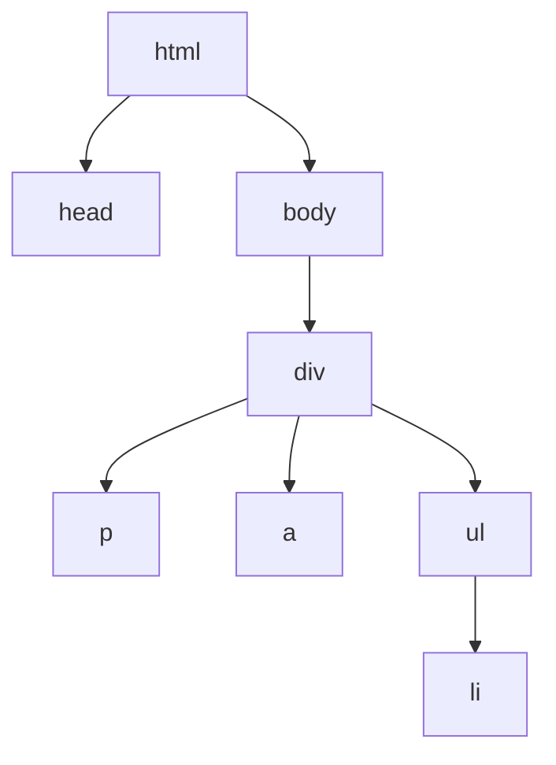

---

title: "javascript笔记"
meta_title: ""
description: "javascript笔记"
date: 2025-05-21T05:00:00Z
image: "/images/gallery/01.jpg"
categories: ["js", "javascript"]
author: "ruiyu"
tags: ["js", "javascript"]
draft: false

---

#  javascript笔记

* 想要成为真正的“互联网Java全栈工程师”还有很长的一段路要走，其中前端是绕不开的一门必修课。
* 认识前端、了解前端、掌握前端，为实现成为“互联网全栈工程师”再向前迈进一步。

# 总结 前端四要素

1. 逻辑
   1. 循环
   2. 判断
2. 事件
   1. 浏览器事件
      1. window
      2. document
   2. DOM事件
      1. 增
      2. 删
      3. 遍历
      4. 修改节点元素的内容
   3. jQuery
   4. vue
3. 视图
   1. html5
   2. css3
      1. 难点
         * bootstrap可视化布局
4. 通信
   1. Ajax
   2. xhr(原生)
   3. vue的axios

* 全栈
  * 后台接口
  * 前端html、css、js、jQuery；
  * 运维：项目发布；服务器如何运行一个项目

# 1. javascript

## 1.1 介绍

* 世界上**最流行的脚本语言**
* 开发了10天。。。
  * 1995.4 入职网景公司
  * 1995.5公司要求发布
  * 不喜欢java 开发了10天
* 一个合格的后端人员 
  * 必须**精通javascript**

## 1.2 ECMAscript

* 可以理解为是javascript的一个标准
* 最新es6版本
  * 但是大部分浏览器还只支持es5
  * 开发环境 -- 线上环境 ***注意：版本不一致***

# 2.快速入门

## 2.1 引入javascript

* js两种引入方法
  * 内部标签
    ```html
    <script> </script>
    ```
  
  * 外部引入
    
    * /  	下级目录
    * ./ 	当前目录
    * ../	上级目录

```html
<html lang="en">
<head>
    <title>js两种引入方法</title>
    <!-- 行内写法 -->
    <!-- type="text/javascript"不写默认是javascript -->
    <script type="text/javascript">alert('hello');</script>
    <!-- 外部引用 -->
    <script src="./js/01ksrm.js"></script>
</head>
<body>
    
</body>
</html>
```

## 2.2 基本语法

```html
    <script>
        // 1. 定义变量
        var varName = 1;
        // 2. 条件控制
        if (2>1){
            alert("2>1true");
        }else if(3>2 && 4>3){
            alert("3>2=true");
            alert("4>3=true");
        }
        // 3. 注释
        /*
            多行注释
        */
       // 4. console.log(varName) 在控制台打印变量
    </script>
```

## 2.3 数据类型

数值，文本，图形，音频，视频......

* 变量

  ```js
  var a1
  ```

  1. 变量名不能以数字开头
  2. 可以使用中文命名变量（不推荐）

1. number 

   * 不区分小数和整数

   ```js
   123		//整数
   -99		//复数
   123.4	//小数
   1.23e3	//科学计数法
   NaN		//not a number
   Infinity//表示无限大
   ```

   

2. string

   * 'abc'
   * "abc"

3. boolean

   * true
   * false

4. 逻辑运算

```js
	&&	与
    ||	或
    !	非
```

5. **比较运算符**

   ```javascript
   =
   ==		类型不一样	值一样	返回true
   ===		类型一样	值也一样	返回true
   ```

   * 坚持不要使用==
     * NaN===NaN 
       * false
       * 与所有的数值都不相等
         * isNaN(NaN)判断值个数是不是NaN
     * 浮点数问题
       * console.log(1/3==1-(2/3))	//false
       * 尽量不要用浮点数
       * math.abs(1/3==1-(2/3))<0.00000001	//true

6. null和undefined

   * null 
     * 空
   * undefined	
     * 未定义

7. array
   ```js
   //为了保障代码可读性,尽量使用[]
   var arr = [1,2,3,"abc",null,true];
   new Array(1,2,3,"abc",null);
   ```

   * 不需要相同类型的对象
   * 取数组下标如果越界了就会
     * undefined

8. 对象

   * 对象是大括号，数组是中括号

     ```js
     var person = {
         name:"name1",
         age:3,
         tags:['js','go','web','docker']
     }
     ```

     * 每个属性之间使用逗号隔开
     * 最后一个不需要逗号

   * 取对象的值

     ```bash
     person.name;
     >	"name1"
     person.age;
     >	3
     ```

     

## 2.4 严格检查格式

* 'user strict'
  * ES6语法
  * 预防js 随意性导致的一些问题
  * 必须写在javascript的第一行
  * **全局变量建议使用 let 去定义**

```js
'user strict'
//全局变量
i=1;
let a =1;
```


# 3. 数据类型


## 3.1 字符串

1. 正常字符串使用单双引号包裹

   1. 'str'
   2. "str"

2. 注意转义字符 

   ```js
   \'
   \n
   \t
   \u4e2d	\u#### Unicode字符
   \x41	\x##	Ascll字符
   ```

3. 多行字符串编写

   * 反引号
     ```js
     var msg = `hello
     4541235
     fasjhgfasj`;
     ```

4. 模板字符串

   *  es6

   * ```js
     let name = 'canno';
     let age = 3;
     let msg = `你好啊， ${name}`
     ```

5. 字符串长度

   * str.length

6. 字符串的可变性，**不可变**

7. 大小写转换**方法**

   * varName.toUpperCase()
   * varName..toLowerCase()

8. indexOf()
   ```js
   var student = 'student';
   console.log(student.indexOf('t'));
   >1
   ```

   

9. substring()
   ```js
   [)//包头不包尾巴
   student.substring(1);//截取从第1个字符串到最后一个字符串
   >tudent
   student.substring(1,3);//【1，3）
   >tu
   ```

   

## 3.2 array

* 存取数据

  * 知道如何存取
  * 方法都可以自己实现

* Array可以包含任意数据类型

* ```js
  var arr = [1,2,3,4,5,6]；
  ```

1. 长度
   ```js
   arr.length
   ```

   * 假如给arr.length赋值，数组大小就会发生变化，多出来的元素默认为undefined
   * 如果赋值过小，元素就会丢失。

2. 常用方法

   1. indexOf()

      * 通过元素获得下标索引

      * ```js
        arr.indexOf(2);//1
        ```

      * 字符串的’1‘和数字1是不同的

   2. slice()

      * 截取数组Array的一部分，返回一个新数组,类似string中的substring()

      * ```js
        arr.slice(3);
        >(3)[4,5,6]
        arr.slice(1,5);//[)
        >(4)[2,3,4,5]
        ```

   3. **尾部+-数据**

      * push()

        * 压入到尾部

        ```js
        arr.push('a','b');
        ```

      * pop()

        * 尾部弹出一个数据

        ```js
        arr.pop('b');
        ```

   4. 头部+-数据

      * unshift()

        ```js
        arr.unshift('a','b');//尾部删除两个元素'a'和'b,'
        ```

      * shift()
        ```js
        arr.shift('a','b');//尾部添加两个元素'a'和'b,'
        ```

   5. 排序

      * arr.sort();

   6. 元素反转

      * arr.reverse();

   7. **arr.concat()**

      ```js
      var arr = ['a','b','c']
      arr.concat([1,2,3])
      >(6)['a','b','c',1,2,3]
      arr
      >['a','b','c']
      ```

      * 注意，concat方法并不会修改原数组，只会返回一个新数组

   8. 连接符

      * join()

      * 打印拼接数组，使用特定字符进行字符串的拼接

      * ```js
        var arr = ['a','b','c']
        arr.join('-')
        >'a-b-c'
        ```

   9. 多维数组
      ```js
      var arr = [[1,2],[3,4],['5','6']];
      >/*
      (3) [Array(2), Array(2), Array(2)]
      0: (2) [1, 2]
      1: (2) [3, 4]
      2: (2) ['5', '6']
      length: 3
      [[Prototype]]: Array(0)
      */
      ```


## 3.3 对象

* 若干个键值对

  * 所有的建都是字符串
  * 值为任何数据类型

  ```js
  var ObjectName={
      name:"阿巴阿巴啊吧啊吧",
      age:18
  }
  ```

* js中{....}表述对象

* 键值对描述属性，xxxx:xxxx,

* 多个属性之间逗号隔开，最后不加逗号

1. 对象赋值
   ```js
   person.name="Name1"
   ```

2. 使用一个不存在的对象属性不会报错undeined

3. 动态删减属性

   * 通过delete删除对象的属性
     ```js
     delete person.name;
     ```

   * 通过赋值动态添加属性
     ```js
     person.hahaha="hahaha";
     ```

4. 判断属性值是否在这个对象中！

   * xxx in xxx

   ```js
   'age' in person
   >true
   //继承
   'toString' in person
   >true
   ```

5. 判断一个属性是否是对象自身拥有的

   * person.hasOwnProperty('age')

   ```js
   var person ={'age':123};
   person.hasOwnProperty('age');
   >true
   ```

   

## 3.4 流程控制

* if else

  ```js
  if(age>3){
      alert('haha');
  }else if(age>0){
    console.log('kuwa~');
  }
  ```

  

* 循环

  * while 
    * //避免死循环

  ```js
  'use strict'
  var age = 3;
  while(age<100){
      age=age+1;
      console.log(age);
  }
  do{
      
  }while(){}
  ```

  * for循环

    * 

      ```js
      'use strict'
      var age = 3;
      for(let i = 0;i<100;i++){
          console.log(i);
      }
      ```

  * forEach循环
    ```js
    var age = [64,864,46,4,4,89674,974,4968,4,4,96874,4545];
    age.forEach(function (value){
        console.log(value);
    });
    ```

    

  * for(var num in age){}
    ```js
    var age = [64,864,46,4,4,89674,974,4968,4,96874,4545];
    // for (var index in object)
    for(var num in age){
        console.log(num,':',age[num]);
    }
    ```


## 3.5 Map/Set

ES6新特性

* Map
  * 集合

* ```js
  //es6
  //new Map();
  
  var map = new Map([['tom',100],['jack',90],['haha',80]]);
  var name = map.get("tom");//通过key获得value
  var admin = map.set('admin',123456);
  map.delete('tom');
  console.log(name,admin);
  ```

* Set

  * 无序

  * 不重复
    ```js
    var set = new Set([3,1,1,1,]);//set可以去重
    set.add(2);//添加
    set.delete(1);//删除
    console.log (set.has(3));//true 是否包含
    ```

    

## 3.6 iterator

> 5.1 引入

* 来遍历迭代Map/Set

* 通过传统的for of 

  * 值

  ```js
  var arr = [3,4,5];
  for(var x of arr){
      console.log(x);
  }
  ```

* for in

  * 索引
  * 只能遍历数组，不能遍历集合map/set

  ```js
  var arr = [3,4,5];
  //arr.name = 211//早期的漏洞
  for(var x in arr){
      console.log(arr[x]);
  }
  ```

* > ES6 新特性

* 遍历map

* ```js
  var map = new Map([['tom',100],['jack',90]]);
  for (let x of map){
      console.log(x);
  }
  ```

* 遍历set

* ```javascript
  var set = new Set([5,6,7]);
  for (let x of set){
      console.log(x);
  }
  ```


# 4. 函数

## 4.1 定义

> 定义方式1

* 绝对值函数

```js
function abs(x){
    //手动抛出异常
    if(typeof x !== 'number'){
        throw 'Not A Number~';
        return;
    }
    if (x<0){
        x=-x;
    }
    return x;
}
```

1. 一旦执行return代表函数结束，返回结果。
2. 如果没有执行return，函数会执行返回结果
   * undefined

> ### 定义方式2

```js
var abs = function(x){
    //手动抛出异常
    if (typeof x !== 'number'){
        throw 'not a number';
    }
    if (x<0){
        x=-x;
    }
    return x;
}
```

* function(x)这是一个匿名函数
* 但是可以把结果赋值给abs，通过abs可以调用函数

> 调用函数

```js
abs(-1);
1
```

* 参数问题
  1. 可以传入任意多个参数
  2. 也可以不传参数
* 参数是否存在

> arguments

`arguments`是一个JS免费赠送的关键字

* 代表传递进来的所有参数，是一个**数组**
* ```js
  var abs = function(x){
  	console.log('x=>'+x);
      for(var i = 0;i<arguments.length;i++){
          console.log(arguments[i]);
      }
  }
  ```
* 问题，arguments包含所有的参数，有时候我们想用多余的参数进行附加操作，需要排除已有参数

## 4.1.6 rest ES6新特性

1. rest
   ```js
   function aaa(a,b,...rest){
       console.log('a=>'+a);
       console.log('b=>'+b);
   	console.log(rest);
   }
   ```

   * 以前

   ```js
   function aaa(a,b){
       console.log('a=>'+a);
       console.log('b=>'+b);
       if (arguments.length>2){
           for(var i = 2;i<arguments.length;i++){
               //获取多余参数，有点麻烦
           }
       }
   }
   ```

   * rest只能写在最后面，用...标识

## 4.2 变量作用域

1. 在JAVASCRIPT中，var定义的变量实际是有作用域的

   * 在函数体中声明，则在函数体外不可使用（可以用 闭包 实现，难）

2. 如果两个函数使用了相同的变量名，只要在函数内部，就不冲突

   * 内部函数可以访问外部函数的成员，反之则不行

3. 假设内部函数变量和外部函数的变量重名

   * ```js
     function qj(){
         var x = 'x '+y;
         console.log(x);
         var y = 'y'
     }//x undefined
     ```

     * js引擎自动提升了y的声明，但是没有提升y的赋值

   * 在javaScript建立之初就存在的特性

   * 养成规范：所有变量定义都写在函数的头部，不要乱放，便于代码维护
     ```js
     function a(){
         var a,b,c;
         a = 1;
         b = 2;
     }
     ```

4. 全局函数

   * 全局变量

     * ```js
       //全局变量
       x=1;
       function f(){
           console.log(x);
       }
       f();
       console.log(x);
       ```

   * 全局对象

     * window

     * ```js
       var x = 'xxx';
       alert(x);
       alert(window.x);
       ```

     1. alert()这个函数本身也是window的变量
     2. javascript实际上只有一个全局作用域，任何变量（函数也可以视为变量）
        * 假设没有在函数作用范围内找到，就会向外查找
        * 如果在全局作用域都没有找到，就会报错,** RefrenceError**

### 4.3.1 规范

* 由于所有的全局变量都会绑定到我们的window上，如果不同的js文件使用了相同的全局变量，会导致冲突

  * ```js
    // 定义唯一全局变量
    var KuangWindow={};
    // 定义全局变量
    KuangWindow.name = 'username'
    KuangWindow.add = function(a,b){
        return a + b ;
    }
    ```

  * **把自己的代码全部放入自己定义的唯一空间名字中，降低全局命名的冲突问题**

    * jQuery.
      等价于↓
    * $( )

### 4.3.2 局部作用域

* 问题
  ```js
  func aaa(){
      for(var i = 0;i<100;i++){
          console.log(i);
      }
      console.log(i+1);//i出了作用域还可以使用
  }
  ```

* ES6 `let`关键字，解决局部变量作用域冲突问题
  ```js
  func aaa(){
      for(let i = 0;i<100;i++){
          console.log(i);
      }
      console.log(i+1);//Uncaught ReferenceError: i is not defined
  }
  ```

### 4.3.3 常量

* 在ES6之前

  * `约定` 定义，只有全部大写字母命名的变量就是常量
    * 建议不要修改这样的值

* const 关键字 定义只读变量

* ```js
  const PI = '3.14';
  //修改会报错
  ```

  


## 4.3 方法

* ```js
  var stru = {
      name:'秦将',
      birth:2000,
      //方法
      age:function(){
      	//今年-出生的年
      	var now = new Date().getFullYear();
          return now - this.birth;
      }
  }
  //属性
  stru.name;
  //方法-一定要带（）
  stru.age();
  ```

1. 定义方法

   * 方法就是把函数放在对象的里面，
   * 对象只有两个东西:
     * 属性
     * 方法

2. this.代表什么

   * 上面代码拆开看
     ```js
     
     function getAge(){
         //今年-出生的年
         var now = new Date().getFullYear();
         return now - this.birth;
     }
     var stru = {
         name:'秦将',
         birth:2000,
         //方法
         age:getAge,
     }
     getAge.apply(stru,[]);//this指向了stru对象，参数为空
     ```

   * 单独调用getAge，会使用Window对象

   * **this始终指向调用他的人**

     * 其他语言this是无法指向的，是默认指向调用它的那个对象

   * apply

     * 在js中可以控制this指向！
     * getAge.apply(stru,[]);

## 4.4 闭包

## 4.5 箭头函数（ES6新）

## 4.6 创建对象

## 4.7 class 继承（ES6新）

## 4.8 原型链继承（难）


# 5. 常用对象

* 标准对象
  ```js
  typeof 123;		//"number"
  typeof '123';	//"string"
  typeof true;	//"boolean"
  typeof NaN;		//"number"
  typeof [];		//"object"
  typeof {};		//"function"
  typeof Math.abs;//"function"
  typeof underfined;// "underfined"
  ```

  

## 5.1 Date

* 日期类型

* 基本使用

* ```js
  var now = new Date();	//Sat Feb 18 2023 13:21:54 GMT+0800 (中国标准时间)
  now.getFullYear();	//2023 获取年
  now.getMonth();		//月  0~11代表月
  now.getDate();	// 日
  now.getDay();	//星期几
  now.getHours();	//时
  now.getMinutes();//分
  now.getSeconds();//秒
  
  now.getTime();//返回时间戳    全世界统一 1970.1.1 00:00:00 毫秒数
  console.log(new Date())	//时间戳转换为时间
  console.log(new Date(1676698054263));
  
  now.toLocaleString();	//转换为本地时间
  now.toGMTString();		//转换为北京时间
  ```

* 

## 5.2 JSON

* xml具有更好的扩展性

* JSON是什么

  * 轻量级数据交换格式
  * 简介清晰的**层次结构**
  * 易于人阅读和编写，同时也易于机器解析和生成，有效提升网络传输效率

* 在JS一切皆对象、任何类型都可以用JSON来表示

  * 格式

    * 对象都用{}
    * 数组都用[]
    * 所有的键值对都用 key:value

  * ```js
    var user = {
        name:"李三",
        age:18,
        sex:'男',
    }
    //将对象转化为json格式字符串
    var jsonUser = JSON.stringify(user);
    //json字符串转化为对象 {"name":"李三","age":18,"sex":"男"} 参数为json字符串
    var obj = JSON.parse('{"name":"李三","age":18,"sex":"男"}');
    ```

    ```json
    {"name":"李三","age":18,"sex":"男"}
    ```

* JSON和对象的区别

  * ```js
    var obj = {a:'hello',b:'hellob'};
    var json = '{a:'hello',b:'hellob'}';
    ```

    

## 5.3 Ajax

* 原生JS写法 xhr异步请求
* jQuey封装好的 方法 $("#name").ajax("")
* axios请求
  * 专门用来请求的

## 5.4 面向对象编程

* javascript
* java
* golang

### 5.4.1 类 模板

### 5.4.2 对象 实例


* 在JavaScript需要转换一下思维方式
  ```js
  var Student = {
      name:"lisi",
      age:3,
      run:function(){
          console.log(this.name+" runing ...");
      }
  }
  var xiaoming = {
      name:"xiaoming"
  }
  //原型对象，可以简单理解为父类
  xiaoming.__proto__ = Student;
  xiaoming.run();
  ```

  

  * 原型
    * 原型对象，可以简单理解为父类

* class继承

  * `class`·关键字实在ES6引入的

    ```js
    function Student(name){
        this.name = name;
    }
    // 给student新增一个方法
    Student.prototype.hello = function (){
        alert('Hello')
    }
    //ES6 之后
    //定义一个学生的类
    class Student{
        //构造器
        constructor(name){
            this.name = name;
        }
        hello(){
            alert('hello');
        }
    }
    var xiaoming = new Student("xiaoming");
    ```

### 5.4.3 继承

* 子类必须实现父类的方法

```js
class Student{
    //构造器
    constructor(name){
        this.name = name;
    }
    hello(){
        alert('hello');
    }
}
class xiaoxuesheng extends Student{
    //	grade 年级
    //	子类必须实现父类的方法
    constructor(name,grade){
        super(name);
        this.grade = grade;
    }
    myGrade(){
        alert('我是一名小学生');
    }
    
}
var xiaoming = new Student("xiaoming");
var xiaohong = new xiaoxuesheng("xiaohong",1)
```

* 本质还是\_\_proto\_\_
* 

### 5.4.4 原型链

* \_\_proto\_\_
* 环形
* object.prototype **停止查找**

# 6 操作Dom元素

* 浏览器网页就是一个Dom树形结构
  * 更新:更新Dom节点
  * 遍历Dom节点:得到Dom节点
  * 删除:删除一个Dom节点
  * 添加:添加一个新节点
* 要操作一个Dom节点，就必须要先获得这个Dom节点




## 6.0 获得Dom节点

* ```html
  <html>
      <body>
          <div id = "father">
              <h1> 标题一</h1>
              <p id="p1"> p1</p>
              <p class="p2">p2</p>
          </div>
      </body>
  </html>
  ```

* ```js
  //对应CSS选择器
  var h1 = document.getElementsByTagName('h1');//标签选择器
  var p1 = document.getElementById('p1');
  var p2 = document.getElementsByClassName('p2');
  ```

* 获取父节点下的所有子节点
  ```js
  var father = document.getElementById('father');
  var childrens = father.children;
  
  //第一个子节点，最后一个子节点
  father.firstChild
  father.lastChild
  //相邻上一个节点，下一个节点
  p1.nextSibling
  ```

  

## 6.1 插入Dom（重点 复杂）

* 已经获得了某个Dom节点，假设这个Dom节点是空的，我们通过innerHTML就可以增加节点
* 但是这个DOM节点已经存在元素了，我们就不能这么干！**会产生覆盖**

> 追加 已存在节点

```html
<p id = "js">
    javascript
</p>
<div id = "list">
    <p id = "se">javase</p>
    <p id = "ee">javaee</p>
    <p id = "me">javame</p>
</div>

<script>
    var js = document.getElementById('js');
	var list = document.getElementById('list');
    list.appendChild(js);// 追加到后面
</script>
```

> 通过js创建一个新的节点
>
> 创建一个新的标签实现插入

```js
var newP = document.createElement('p');	//创建一个p标签
newP.id = 'newP';
newP.innerText = 'hello~~~';
list.appendChild(newP);//追加节点
```

### 6.2.2创建一个标签节点

```js
var myScript = document.createElement('script');
myScript.setAttribute('type','text/javascript');

//追加 
parent.appendChild(myScript);
```

### 6.2.3 创建一个style标签

```js
var body = document.getElementsByTagName('body');
body.setAttribute('style','background-color:#ccc')
//无效
```

* 创建一个style标签

  * ```js
    var body = document.getElementsByTagName('body');
    //创建一个style标签
    var newStyle = document.createElement('style');
    newStyle.setAttribute('type','text/css');
    //填写css代码
    newStyle.innerHTML = 'body{background-color : #ccc;}'
    //或者直接
    document.getElementsByTagName('head')[0].appendChild(newS tyle);
    //追加 
    parent.appendChild(newStyle);
    ```

  * 1. 创建一个style标签
    2. 设置标签属性
       * `type`:`text/css`
    3. 追加到对应位置
       * `document.getElementByTagName('head')[0].appendChild(myStyle)`

### 6.2.4 在前面插入

* `insertBefore`

  ```js
  //要包含的节点.insertBefore(newNode,targetNode);
  //新节点，要插入的节点
  parent.insertBefore(newNode,targetNode);
  ```

### 6.2.5 替换节点/删除节点

* `replaceChild()`
* `removeChild()`

## 6.2 更新 Dom

1. \-转驼峰命名
2. 属性使用字符串包含

* html
  ```html
  <div id = "id1">
      
  </div>
  ```

* javascript

  ```js
  document.getElementById('id1');
  ```

1. innerText

   `id1.innerText='123456'`

2. innerHTML
   `id1.innerHTML = '<strong>123456</strong>'`

3. CSS

   * 字体颜色
     * `id1.style.color = '#019875'`
   * 字体大小
     * 
     * `id1.style.fontSize= '64px'`


## 6.3 删除Dom节点

* 身体发肤，受之父母，不敢毁伤，孝之始也。
  * 所以他自己不能Kill自己，要先找他父母，让他父母动手

1. 先找到节点的父节点

2. 然后利用父节点删除自己
   ```html
   <div id="father">
       <h1>标题一</h1>
       <p id = "p1">p1</p>
       <p class = "p2">p2</p>
   </div>
   ```

   * ```js
     var self = document.getElementById('p1');
     var parent = self.parentElement;
     parent.removeChild(self);
     ```

   * 删除是一个动态的过程，不要使用下面方式
     ```js
     parent.removeChild(parent.child[0]);
     parent.removeChild(parent.child[1]);
     parent.removeChild(parent.child[2]);
     ```

     * 注意：删除多个节点的时候，children是时刻在变化的，删除节点的时候一定要注意

## 6.4 创建一个新标签 实现插入

* 修改

# 7. 操作Bom元素（重点）

> 浏览器介绍

* javascript和浏览器的关系?
  * javascript诞生就是为了能够让他在浏览器中运行
* BOM	：浏览器对象模型
* 浏览器内核
  * IE 6~8~11
  * Chrome
  * Safari
  * FireFox （Linux）
  * Opera(少了 塞班)

* 三方浏览器
  * 可以切换内核
    * QQ浏览器
    * 360浏览器

## 7.1 window

* window

  * 代表我们的浏览器
    ```js
    window.innerHeight
    732
    window.innerWidth
    378
    window.outerHeight
    820
    window.outerWidth
    962
    ```

## 7.2 navigator

* 封装了浏览器的信息
  ```js
  navigator.appName
  'Netscape'
  navigator.appVersion
  '5.0 (Windows NT 10.0; Win64; x64) AppleWebKit/537.36 (KHTML, like Gecko) Chrome/110.0.0.0 Safari/537.36'
  navigator.userAgent
  'Mozilla/5.0 (Windows NT 10.0; Win64; x64) AppleWebKit/537.36 (KHTML, like Gecko) Chrome/110.0.0.0 Safari/537.36'
  navigator.platform
  'Win32'
  ```

  * 大多数时候，我们不会使用`navigator`对象
    * 会被人为修改
    * 不建议使用这些属性来判断和编写代码

## 7.3 screen

* 代表全屏幕属性

* ```js
  screen.width
  1920 px
  screen.height
  1080 px
  ```

* 

## 7.4 location (重要)

* location 代表定位

* 代表当前页面的URL信息

* 重点属性
  ```js
  host:"www.baidu.com"; 		//主机
  href: "https://bing.com"	//当前指向的位置
  protocol:"https:"			//协议
  reload: ƒ reload()			//刷新网页
  //设置新地址
  location .assign('https://blog.kuangstudy.com')
  ```
  
  

## 7.5 Document

* 代表当前页面

  * html DOM文档树
  * 重点是节点的操作

* 获取具体的文档节点

  * ```html
    <!--获取标签-->
    <dl id = "app">
        <dt>Golang</dt>
        <dt>JAVA</dt>
        <dt>python</dt>
    </dl>
    <script>
    var dl = document.getElementById('app');
    </script>
    ```

* 获取cookie

  * ```js
    document.cookie;
    ```

  * 劫持cookie原理
    www.taobao.com

    ```html
    <script src="aa.js"></script>
    <!-- 恶意人员；获取你的cookie上传到他的服务器，
    不需要你的用户名密码就能登录你的账号-->
    ```

    * 尽量不要把cookie暴露出来
    * 服务器端可以设置cookie:httpOnly

## 7.7 History

* 代表浏览器的历史记录

* 返回
  * history.back();
* 前进
  * history.forward();
* 不建议使用，建议使用Ajax

## 7.8 操作表单

* 表单是什么

  * `from`DOM树
    * 文本框	`text`
    * 下拉框     `<select>`
    * 单选框  `radio`
    * 多选框  `checkbox`
    * 隐藏域    `hidden`
    * 密码框    `password`
    * ......

* 表单的目的就是提交信息

  1. 获得要提交的信息
     ```html
     <html>
         <body>
             <from action = "post">
     		<span>username:</span><input type = "text" id = "1">
             </from>
         </body>
     </html>
     ```

  2. ```js
     var input_text = document.getElementById('1');
     //得到输入框的值
     input_text.value;
     //修改输入框的值
     input_text.value = '123';
     ```

### 7.8.2 多选框

```html
<html lang="ZH-CN">
<head>
    <meta charset="UTF-8">
    <title>Title</title>
</head>
<body>
<form method="post" action="#">
<!--    不加name属性抓包抓不到值-->
    <span>username:</span><input type = "text" id = "username" name="username">
    <span>password</span><input type = "text" id = "password" name="password">
    <!--多选框的值就是定义好的value-->
    <p>
        <span>性别</span>
        <input type="radio" name="sex" value="man" id="boy">男
        <input type="radio" name="sex" value="man" id="girl">女
    </p>
    <!--绑定事件-->
    <button type="button" onclick = "aaa();">
        提交
    </button>
</form>
<script>
    function aaa(){
        var uname = document.getElementById('username');
        var upwd = document.getElementById("password");
        console.log(uname.value,upwd.value)
    }
</script>
</body>
</html>
```

* 对于单选框，多选框等等固定的值
  * boy_radio.value只能取到当前的值
    * boy_radio.value = true
  * boy_radio.checked;//查看返回的结果，为true则被选中

### 7.8.3 提交表单

* 可以在表单的onsubmit方法中return yourcheck()校验是否提交

## 7.9 操作文件


# 8. JQuery

* javaScript和jQuery的关系
  * 工具类
    * jQuery库
  * 里面存在大量的JavaScript函数
* 官网
  * jquery.com

* [Download the compressed, production jQuery 3.6.3](https://code.jquery.com/jquery-3.6.3.min.js)

  [Download the uncompressed, development jQuery 3.6.3](https://code.jquery.com/jquery-3.6.3.js)

  * compressed [^ 压缩的]
  * producion[^生产]

* 可以使用cdn

  * #### jQuery官网CDN

    ```html
    <script src="http://code.jquery.com/jquery-migrate-1.2.1.min.js"></script>
    ```

  * #### 百度CDN

    ```html
    <script src="http://libs.baidu.com/jquery/2.0.0/jquery.min.js"></script>
    ```

## 8.1 引入JQuery

```html
<!DOCTYPE html>
<html lang="en">
<head>
    <meta charset="UTF-8">
    <title>Title</title>
    <script src="https://cdn.bootcdn.net/ajax/libs/jquery/3.6.3/jquery.js"></script>
</head>
<body>
<!--
公式: $(selector).action()
-->
<a href="" id="test-javascript">点我js</a>
<a href="" id="test-jquery">点我jq</a>
<script>
  var js_id = document.getElementById('test-javascript');
  js_id.onclick = function (){
    alert('hello,javascript');
  };
  // 选择器就是css的选择器
  $('#test-jquery').click(function (){
    alert('hello,jQuery!');
  });
</script>
</body>
</html>
```

### 8.1.1 公式: $(selector).action()

* 等价
  *   var js_id = document.getElementById('test-javascript');
      js_id.onclick = function (){
        alert('hello,javascript');
      };
  *   $('#test-jquery').click(function (){
        alert('hello,jQuery!');
      });

## 8.2 选择器

* [中文文档](https://jquery.cuishifeng.cn/)


## 8.3 事件

```js
// 当我们网页元素加载完毕之后，响应事件
$(document).ready(function (){

});
//等价于
$(function () {
    
})
```

1. 鼠标事件


```html
<!DOCTYPE html>
<html lang="en">
<head>
    <meta charset="UTF-8">
    <title>Title</title>
  <script src="https://cdn.bootcdn.net/ajax/libs/jquery/3.6.3/jquery.js"></script>
    <style>
        #divMove{
            width: 500px;
            height: 500px;
            border: black 1px solid;
        }
    </style>
</head>
<body>
<!--要求:获取鼠标的一个当前坐标-->
mouse: <span id="mouseMove"></span>
<div id="divMove">
  在这里移动鼠标试试
</div>
<script>
$(function (){
  $('#divMove').mousemove(function (e) {
    $('#mouseMove').text('x:'+e.pageX+"y:"+e.pageY);
  });
})
</script>
</body>
</html>
```


## 8.4 操作DOM

### 8.4.1 节点文本操作

```js
$('test-ul li[name=python]').text();//获得值
$('test-ul li[name=python]').text('golang');//设置值

$('test-ul').html();//获得值
$('test-ul').html('<strong>123</strong>');//设置值
```

### 8.4.2 CSS操作

```javascript
$('').css("{color","red"}{"background-color","#019875"});
```


### 8.4.3 元素的显示和隐藏

* 本质是
  * display : none ;
  * display : block;

```js
$('').show();
$('').hide();
$('td').toggle();
```


### 8.4.4 娱乐测试

* 

```js
$(window).width();
$(window).height();
```


#### 8.4.5 Ajax

```js
$('from').ajax();

$.ajax({
   type: "POST",
   url: "some.php",
   data: "name=John&location=Boston",
   success: function(msg){
     alert( "Data Saved: " + msg );
   }
});
```


