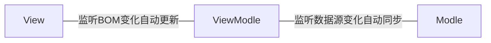

# vue

# 1. 什么是 Vue？

* Vue (发音为 /vjuː/，类似 **view**) 是一款用于构建用户界面的 JavaScript 框架。

* 它基于标准 HTML、CSS 和 JavaScript 构建，并提供了一套声明式的、组件化的编程模型，帮助你高效地开发用户界面。无论是简单还是复杂的界面，Vue 都可以胜任。

## 1.1 Vue 的两个核心功能：

- **声明式渲染**：Vue 基于标准 HTML 拓展了一套模板语法，使得我们可以声明式地描述最终输出的 HTML 和 JavaScript 状态之间的关系。
- **响应性**：Vue 会自动跟踪 JavaScript 状态并在其发生变化时响应式地更新 DOM。

## 1.2 渐进式框架

Vue 是一个框架，也是一个生态。其功能覆盖了大部分前端开发常见的需求。但 Web 世界是十分多样化的，不同的开发者在 Web 上构建的东西可能在形式和规模上会有很大的不同。考虑到这一点，Vue 的设计非常注重灵活性和“可以被逐步集成”这个特点。根据你的需求场景，你可以用不同的方式使用 Vue：

- 无需构建步骤，渐进式增强静态的 HTML
- 在任何页面中作为 Web Components 嵌入
- 单页应用 (SPA)
- 全栈 / 服务端渲染 (SSR)
- Jamstack / 静态站点生成 (SSG)
- 开发桌面端、移动端、WebGL，甚至是命令行终端中的界面

# 2. Vue 的组件风格书写

Vue 的组件可以按两种不同的风格书写

- 选项式 API 
- 组合式 API

## 2.1 选项式 API

- 使用选项式 API，我们可以用包含多个选项的对象来描述组件的逻辑，例如`data`、`methods`和 `mounted`
- 选项所定义的属性都会暴露在函数内部的`this`上，它会指向当前的组件实例


## 2.2 组合式 API 

- 通过组合式 API，我们可以使用导入的 API 函数来描述组件逻辑
- 在单文件组件中，组合式 API 通常会与`<script setup>`搭配使用
- 这个`setup`属性是一个标识，告诉 Vue 需要在编译时进行一些处理，让我们可以更简洁地使用组合式 API
- `<script setup>`中的导入和顶层变量/函数都能够在模板中直接使用


## 2.3 双向绑定原理

* MVVM 指的是**Model**、**View**和**ViewModel**
  - Model：页面渲染用到的数据源
  - View：页面所渲染的 DOM 结构
  - ViewModel：表示 vue 的实例



* 当数据源发生变化时，会被 VM 监听到，VM 会根据最新的数据源自动更新页面的结构 
* 当表单元素的值发生变化时，也会被 VM 监听到，VM 会把变化过后最新的值自动同步到 Model 数据源中


# 3. vueJS安装

## 3.1 运行环境vite

1. 安装并执行 create-vue：`npm init vue@latest`

2. 选择项目功能
   ```bash
   ✔ Project name: … <your-project-name> 
   ✔ Add TypeScript? … No / Yes 
   ✔ Add JSX Support? … No / Yes 
   ✔ Add Vue Router for Single Page Application development? … No / Yes 
   ✔ Add Pinia for state management? … No / Yes 
   ✔ Add Vitest for Unit testing? … No / Yes 
   ✔ Add Cypress for both Unit and End-to-End testing? … No / Yes 
   ✔ Add ESLint for code quality? … No / Yes 
   ✔ Add Prettier for code formatting? … No / Yes 
   
   Scaffolding project in ./<your-project-name>... 
   Done.
   ```

3. 切换到项目目录：`cd <your-project-name>`

4. 安装项目依赖：`npm install`

5. 启动开发服务器：`npm run dev`

6. 将应用发布到生产环境：`npm run build`

## 3.2 vue 项目的运行流程

* main.js

```js
// 从 vue 中引入 createApp 函数 
import {createApp} from 'vue' 

// 导入根组件 APP.vue 
import App from './App.vue'

// 通过 createApp 函数创建应用实例 
// 通过 mount 函数，将应用实例渲染在容器元素里面 
createApp(App).mount('#app')
```

* `App.vue`：用来编写待渲染的模板结构，也成为根组件
* `index.html`：单页面程序唯一的界面文件
* `main.js`：项目的主入口文件，把 App.vue 渲染到了 index.html 中

### 3.3 每个 .vue 组件都由三部分构成

* 分别是：

  - `template`：组件的模板结构 -- 视图
    * template 是容器标签，只起到包裹性质的作用，它不会被渲染为真正的 DOM 元素

  - `script`：组件的 JavaScript 行为 -- vue 实例

  - `style`：组件的样式 -- css 样式

### 3.4 举例演示MVVM

#### 3.4.1 选项式

```vue
<!-- 脚本区域 -->
<script>
    // vue 实例对象（viewModel）
    export default {
        // 数据源存放到 data 节点中（model）
        data: () => ({
            account: 'Abc'
        }),
        // 方法节点
        methods: {
            changeAccount() {
                this.account += "="
            }
        }
    }
</script>

<!-- 视图区域（view） -->
<template>
    <!-- 使用数据源得 DOM -->
    <input type="text" v-model="account">
    <button @click="changeAccount">点我打印数据源 account</button>
</template>
```

#### 3.4.2 组合式

```vue
<!-- 脚本区域 -->
<script setup>
    // 引入 API 函数
    import { ref } from 'vue'
    // 数据源
    let account = ref('Abc')
    // 方法
    function chageAccount() {
        account.value += '='
    }
</script>

<!-- 视图区域（view） -->
<template>
    <!-- 使用数据源得 DOM -->
    <input type="text" v-model="account">
    <button @click="chageAccount">点我更改account</button>
</template>
```


### 3.5 响应式举例

#### 3.5.1 选项式

- 可用`data`选项来声明组件的响应式状态；该`data`选项的值应为返回一个对象的函数；

- `data`函数返回对象的所有顶层属性都会被代理到组件实例（即方法和生命周期钩子中的 `this`）上

- ```vue
  <script>
      export default {
          // data 选项的值应该是一个函数返回的对象
          data: () => ({
              account: 'Abc',
              student: {
                  name: 'Jack',
                  age: 30
              }
          }),
          methods: {
              changeAccount() {
                  // 取出数据源可通过 this（当前组件得实例对象） 关键字获取
                  this.account += '='
              },
              changeStudentAge() {
                  this.student.age ++
              }
          }
      }
  </script>
  
  <template>
    
      <h1>账号：{{ account }}</h1>
      <button @click="changeAccount">点我更改账号</button>
  
      <hr>
  
      <h1>学生：{{ student }}</h1>
      <button @click="changeStudentAge">点我更改学生年龄</button>
  
  </template>
  ```

- 

#### 3.5.2 组合式

* 如果在组合式 API 中直接声明普通变量的数据源，他们并不具备响应式数据

* ```vue
  <script setup>
  
      // 普通的变量不具备响应式
      let account = 123
  
      function changeAccount() {
          account+= 1
          console.log(account)
      }
  
      // 普通类型的对象，不具备响应式
      let emp = {
          salary: 7000,
          name: 'Annie'
      }
  
      function changeEmpSalary() {
          emp.salary += 100
          console.log(emp)
      }
  
  </script>
  
  <template>
      <h1>账号：{{ account }}</h1>
      <button @click="changeAccount">点我更改账号</button>
  
      <hr>
      <h1>员工：{{ emp }}</h1>
      <button @click="changeEmpSalary">点我更改薪资</button>
  
  </template>
  ```


### 3.6 组合式API的响应式数据

* 如果在组合式 API 中直接声明普通变量的数据源，他们并不具备响应式数据

#### 3.6.1 reactive()  函数

* `reactive()`函数只对对象类型有效（对象、数组、`Map`、`Set`），对`string`、`number`和 `boolean`这样的原始类型无效

* ```vue
  <script setup>
  
      // 引入 reactive 函数
      import { reactive } from 'vue'
  
      // reactive 对原始类型是无效（不具备响应式）
      let account = reactive('Abc')
  
      function changeAccount() {
          account += '='
          console.log(account)
      }
  
      // reactive 对象数据源（具有响应式）
      let emp = reactive({
          name: 'Jack',
          salary: 7000
      })
  
      function changeEmpSalary() {
          emp.salary += 1
          console.log(emp)
      }
  
  </script>
  
  <template>
  
      <hr>
      <h1>账号：{{ account }}</h1>
      <button @click="changeAccount">点我更改账号</button>
  
      <hr>
      <h1>员工：{{ emp }}</h1>
      <button @click="changeEmpSalary">点我更改员工薪资</button>
  
  </template>
  ```


#### 3.6.2 `ref()` 函数

- 使用`ref()`方法我们可以创建任何类型的响应式数据，获取时需要通过`.value`来进行获取

- 当值为对象类型时，会用`reactive()`自动转换它的 `.value`

- ```vue
  <script setup>
  
      // 引入 ref 函数，来声明响应式对象
      import { ref } from 'vue'
      
      // 使用 ref 函数来声明原始类型的数据源，具备响应式
      let account = ref('Abc')
  
      // 更改账号，控制台查看最新值
      function changeAccount() {
          // 通过 ref 函数声明的响应式数据，需要使用 .value 来获取数据的值
          account.value += '='
          console.log(account)
      }
  
      // 使用 ref 函数来声明对象类型的数据源：具备响应式
      let emp = ref({
          salary: 7000,
          name: 'Jack'
      })
      
      // 更改员工薪资，控制台查看最新值
      function changeEmpSalary() {
          // 通过 ref 函数声明的响应式数据，需要使用 .value 来获取数据的值
          emp.value.salary += 100
          console.log(emp)
      }
  </script>
  
  <template>
    
      <h1>账号：{{ account }}</h1>
      <button @click="changeAccount">点我更改账号</button>
  
      <hr>
  
      <h1>员工：{{ emp }}</h1>
      <button @click="changeEmpSalary">点我更改员工薪资</button>
  
  </template>
  ```

  

# 4. 应用

## 4.1 应用实例

每个 Vue 应用都是通过 [`createApp`](https://cn.vuejs.org/api/application.html#createapp) 函数创建一个新的 **应用实例**：

js

```js
import { createApp } from 'vue'

const app = createApp({
  /* 根组件选项 */
})
```

## 4.2 根组件

* App.vue

我们传入 `createApp` 的对象实际上是一个组件，每个应用都需要一个“根组件”，其他组件将作为其子组件。

如果你使用的是单文件组件，我们可以直接从另一个文件中导入根组件。

js

```js
import { createApp } from 'vue'
// 从一个单文件组件中导入根组件
import App from './App.vue'

const app = createApp(App)
```

虽然本指南中的许多示例只需要一个组件，但大多数真实的应用都是由一棵嵌套的、可重用的组件树组成的。例如，一个待办事项 (Todos) 应用的组件树可能是这样的：


```css
App (root component)
├─ TodoList
│  └─ TodoItem
│     ├─ TodoDeleteButton
│     └─ TodoEditButton
└─ TodoFooter
   ├─ TodoClearButton
   └─ TodoStatistics
```

后续会讨论如何定义和组合多个组件。在那之前，我们得先关注一个组件内到底发生了什么。

## 4.3 挂载应用

* 应用实例必须在调用了 `.mount()` 方法后才会渲染出来。
  * 该方法接收一个“容器”参数，可以是一个实际的 DOM 元素或是一个 CSS 选择器字符串：

* html

```html
<div id="app"></div>
```

* js

```js
app.mount('#app')
```

应用根组件的内容将会被渲染在容器元素里面。容器元素自己将**不会**被视为应用的一部分。

`.mount()` 方法应该始终在整个应用配置和资源注册完成后被调用。同时请注意，不同于其他资源注册方法，**它的返回值是根组件实例而非应用实例。**

### DOM 中的根组件模板

* 当在未采用构建流程的情况下使用 Vue 时，我们可以在挂载容器中直接书写根组件模板：

* html

```html
<div id="app">
  <button @click="count++">{{ count }}</button>
</div>
```

* js

```js
import { createApp } from 'vue'

const app = createApp({
  data() {
    return {
      count: 0
    }
  }
})

app.mount('#app')
```

当根组件没有设置 `template` 选项时，Vue 将自动使用容器的 `innerHTML` 作为模板。

## 应用配置

* 应用实例会暴露一个 `.config` 对象允许我们配置一些应用级的选项
  * 例如定义一个应用级的错误处理器，用来捕获所有子组件上的错误：

* js

```js
app.config.errorHandler = (err) => {
  /* 处理错误 */
}
```

应用实例还提供了一些方法来注册应用范围内可用的资源，例如注册一个组件：

* js

```js
app.component('TodoDeleteButton', TodoDeleteButton)
```

这使得 `TodoDeleteButton` 在应用的任何地方都是可用的。我们会在指南的后续章节中讨论关于组件和其他资源的注册。你也可以在 [API 参考](https://cn.vuejs.org/api/application.html)中浏览应用实例 API 的完整列表。

确保在挂载应用实例之前完成所有应用配置！

## 多个应用实例

应用实例并不只限于一个。`createApp` API 允许你在同一个页面中创建多个共存的 Vue 应用，而且每个应用都拥有自己的用于配置和全局资源的作用域。

js

```js
const app1 = createApp({
  /* ... */
})
app1.mount('#container-1')

const app2 = createApp({
  /* ... */
})
app2.mount('#container-2')
```

如果你正在使用 Vue 来增强服务端渲染 HTML，并且只想要 Vue 去控制一个大型页面中特殊的一小部分，应避免将一个单独的 Vue 应用实例挂载到整个页面上，而是应该创建多个小的应用实例，将它们分别挂载到所需的元素上去。


# 5. 模板语法

* 语法糖
  1. v-on:functionName
     * @functionName
  2. v-bind:id
     * :id

## 5.1 插值

### 5.1.1 文本

* 数据绑定最常见的形式就是使用’Mustache‘（双大括号）语法的文本插值

  * ```html
    <span>Message:{{ msg }}</span>
    ```

    * mustache标签将会被替代为对应组件实例中`msg`的property值。
      * `property`    prop 自己的；拥有 + er 表名词 + ty 表状态 → 财产；特性
      * 这里指的是属性
    * 无论何时，绑定的组件实例上`msg`property发生改变，插值处的内容都会更新。

* 通过使用`v-once指令`，也可以执行一次性插值

  * 当数据改变时，插值处的内容不会更新。

  * 但请留心这会影响到该节点上的其他数据绑定

  * ```html
    <span v-once>这个将property不会改变：{{ msg }}</span>
    ```
  
  * ```vue
    <script>
    //声明式渲染，可以提升我们的开发效率
    //提前说好，要用到的数据，要用到的时候直接拿去渲染
    export default{
      //export 导出，将我们的对象导出出去
      data(){
        return{
        num:4869,
        uname:"张三"
      }
      },
      methods:{//给VUE定义方法
        changeUserName:function(){
          //this指向当前的VUE实例
          this.uname = "李四"
        }
    }
    }
    </script>
    
    <template>
      <!-- 组件实例的所有property，无论如何定义，都可以在组件模板中访问 -->
      <div><!-- vue3不需要一定要有一个根元素,但是VScode不支持这种语法 -->
      <p>{{ num }}</p>
      <p>{{ uname }}</p>
    
      <!-- v-once :当数据改变时，插值处数据不会更新 -->
      <p v-once>{{ uname }}</p>
      <button @click="changeUserName">change uname</button>
      </div>
    </template>
    ```
  
  * 点击change uname 按钮后
  
    1. 张三
       张三
    2. 李四
       张三

### 5.1.2 **原始 HTML**

* 指令

  * v-html=""

* 双大括号会将数据解释为普通文本，而非 HTML 代码。

  * 为了输出真正的 HTML，需要使用 `v-html` 指令

* ```vue
  <script>
  export default{
    //export 导出，将我们的对象导出出去
    data(){
      return{
      msg:"<h2>副标题</h2>"
      }
    }
  }
  </script>
  
  <template>
    <p v-html="msg"></p>
  </template>
  
  <style>
  </style>
  ```

* 注意:你的站点上动态渲染的任意 HTML 可能会非常危险，因为它很容易导致 [XSS 攻击](https://en.wikipedia.org/wiki/Cross-site_scripting)。

  * 请只对可信内容使用 HTML 插值，**绝不要**对用户提供的内容使用插值。

### 5.1.3 **Attribute 属性**

* Mustache 语法不能作用在 HTML attribute 上，遇到这种情况应该使用 [`v-bind` 指令](https://v2.cn.vuejs.org/v2/api/#v-bind)：
  ```html
  <div v-bind:id="dynamicId"></div>
  ```

* 对于布尔 attribute (它们只要存在就意味着值为 `true`)，`v-bind` 工作起来略有不同，在这个例子中：

  ```html
  <button v-bind:disabled="isButtonDisabled">Button</button>
  ```

  如果 `isButtonDisabled` 的值是 `null`、`undefined` 或 `false`，则 `disabled` attribute 甚至不会被包含在渲染出来的 `<button>` 元素中。

### 5.1.4 [使用 JavaScript 表达式](https://v2.cn.vuejs.org/v2/guide/syntax.html#使用-JavaScript-表达式)

迄今为止，在我们的模板中，我们一直都只绑定简单的 property 键值。但实际上，对于所有的数据绑定，Vue.js 都提供了完全的 JavaScript 表达式支持。

```html
{{ number + 1 }}

{{ ok ? 'YES' : 'NO' }}

{{ message.split('').reverse().join('') }}

<div v-bind:id="'list-' + id"></div>
```

这些表达式会在所属 Vue 实例的数据作用域下作为 JavaScript 被解析。有个限制就是，每个绑定都只能包含**单个表达式**，所以下面的例子都**不会**生效。

```html
<!-- 这是语句，不是表达式 -->
{{ var a = 1 }}

<!-- 流控制也不会生效，请使用三元表达式 -->
{{ if (ok) { return message } }}
```

`注意:`模板表达式都被放在沙盒中，只能访问[全局变量的一个白名单](https://github.com/vuejs/vue/blob/v2.6.10/src/core/instance/proxy.js#L9)，如 `Math` 和 `Date` 。你不应该在模板表达式中试图访问用户定义的全局变量。


## 5.2 指令

### 5.2.1 参数

* 指令 (Directives) 是带有 `v-` 前缀的特殊 attribute。
* 指令 attribute 的值预期是**单个 JavaScript 表达式** (`v-for` 是例外情况，稍后我们再讨论)。
* 指令的职责是，**当表达式的值改变时，将其产生的连带影响，响应式地作用于 DOM。**
* 

### 5.2.2 动态参数

* **一些指令能够接收一个“参数”**，在指令名称之后以冒号表示。例如，`v-bind` 指令可以用于响应式地更新 HTML attribute：

  ```html
  <a v-bind:href="url">...</a>
  ```

  在这里 `href` 是参数，告知 `v-bind` 指令将该元素的 `href` attribute 与表达式 `url` 的值绑定。

* **另一个例子是 `v-on` 指令，它用于监听 DOM 事件：**

  ```html
  <a v-on:click="doSomething">...</a>
  ```

  在这里参数是监听的事件名。我们也会更详细地讨论事件处理。

### 5.2.3 动态参数

> 2.6.0 新增

从 2.6.0 开始，可以用方括号括起来的 JavaScript 表达式作为一个指令的参数：

```html
<!--
注意，参数表达式的写法存在一些约束，如之后的“对动态参数表达式的约束”章节所述。
-->
<a v-bind:[attributeName]="url"> ... </a>
```

这里的 `attributeName` 会被作为一个 JavaScript 表达式进行动态求值，求得的值将会作为最终的参数来使用。例如，如果你的 Vue 实例有一个 `data` property `attributeName`，其值为 `"href"`，那么这个绑定将等价于 `v-bind:href`。

同样地，你可以使用动态参数为一个动态的事件名绑定处理函数：

```
<a v-on:[eventName]="doSomething"> ... </a>
```

在这个示例中，当 `eventName` 的值为 `"focus"` 时，`v-on:[eventName]` 将等价于 `v-on:focus`。

#### 对动态参数的值的约束

动态参数预期会求出一个字符串，异常情况下值为 `null`。这个特殊的 `null` 值可以被显性地用于移除绑定。任何其它非字符串类型的值都将会触发一个警告。

#### 对动态参数表达式的约束

动态参数表达式有一些语法约束，因为某些字符，如空格和引号，放在 HTML attribute 名里是无效的。例如：

```html
<!-- 这会触发一个编译警告 -->
<a v-bind:['foo' + bar]="value"> ... </a>
```

变通的办法是使用没有空格或引号的表达式，或用计算属性替代这种复杂表达式。

在 DOM 中使用模板时 (直接在一个 HTML 文件里撰写模板)，还需要避免使用大写字符来命名键名，因为浏览器会把 attribute 名全部强制转为小写：

```html
<!--
在 DOM 中使用模板时这段代码会被转换为 `v-bind:[someattr]`。
除非在实例中有一个名为“someattr”的 property，否则代码不会工作。
-->
<a v-bind:[someAttr]="value"> ... </a>
```

* pritice

  * ```vue
    <script>
        export default{
      //export 导出，将我们的对象导出出去
            data(){
                attributeName:'id',
                MouseEvent:"click"
            }
        },
            methods:{//给VUE定义方法
            }
        }
    </script>
    <template>
      <!-- v-on : 用于监听DOM事件 -->
      <button v-on:click="changeColor">changeColor</button>
      <!-- v-on 语法糖 : @ -->
      <button @click="id='id-no2'">改变颜色</button>
    
      <!-- 动态参数 -->
      <!-- 动态属性 -->
      <p v-bind:[attributeName]="id">v-bind绑定 动态属性</p>
      <button @click="attributeName='class'">改变属性 change property</button>
      <!-- 动态事件 -->
      <br>
      <button @[MouseEvent]="attributeName='class'">改变属性</button>
      <button @click="MouseEvent='mouseover'">改变事件</button>
    </template>
    <style>
    </style>
    ```

  * 


### 5.2.4 [修饰符](https://v2.cn.vuejs.org/v2/guide/syntax.html#修饰符)

修饰符 (modifier) 是以半角句号 `.` 指明的特殊后缀，用于指出一个指令应该以特殊方式绑定。例如，`.prevent` 修饰符告诉 `v-on` 指令对于触发的事件调用 `event.preventDefault()`：

```
<form v-on:submit.prevent="onSubmit">...</form>
```

在接下来对 [`v-on`](https://v2.cn.vuejs.org/v2/guide/events.html#事件修饰符) 和 [`v-for`](https://v2.cn.vuejs.org/v2/guide/forms.html#修饰符) 等功能的探索中，你会看到修饰符的其它例子。


### 5.2.5 [缩写](https://v2.cn.vuejs.org/v2/guide/syntax.html#缩写)

`v-` 前缀作为一种视觉提示，用来识别模板中 Vue 特定的 attribute。当你在使用 Vue.js 为现有标签添加动态行为 (dynamic behavior) 时，`v-` 前缀很有帮助，然而，对于一些频繁用到的指令来说，就会感到使用繁琐。同时，在构建由 Vue 管理所有模板的[单页面应用程序 (SPA - single page application)](https://en.wikipedia.org/wiki/Single-page_application) 时，`v-` 前缀也变得没那么重要了。因此，Vue 为 `v-bind` 和 `v-on` 这两个最常用的指令，提供了特定简写：

#### [`v-bind` 缩写](https://v2.cn.vuejs.org/v2/guide/syntax.html#v-bind-缩写)

```
<!-- 完整语法 -->
<a v-bind:href="url">...</a>

<!-- 缩写 -->
<a :href="url">...</a>

<!-- 动态参数的缩写 (2.6.0+) -->
<a :[key]="url"> ... </a>
```

#### [`v-on` 缩写](https://v2.cn.vuejs.org/v2/guide/syntax.html#v-on-缩写)

```
<!-- 完整语法 -->
<a v-on:click="doSomething">...</a>

<!-- 缩写 -->
<a @click="doSomething">...</a>

<!-- 动态参数的缩写 (2.6.0+) -->
<a @[event]="doSomething"> ... </a>
```

它们看起来可能与普通的 HTML 略有不同，但 `:` 与 `@` 对于 attribute 名来说都是合法字符，在所有支持 Vue 的浏览器都能被正确地解析。而且，它们不会出现在最终渲染的标记中。缩写语法是完全可选的，但随着你更深入地了解它们的作用，你会庆幸拥有它们。


# 6. Data Property 和方法

## 6.1 Data Property


## 6.2 方法


### 6.2.1 防抖和节流


# 7. 计算属性和侦听器

## 7.1 计算属性

模板内的表达式非常便利，但是设计它们的初衷是用于简单运算的。在模板中放入太多的逻辑会让模板过重且难以维护。例如：

```
<div id="example">
  {{ message.split('').reverse().join('') }}
</div>
```

在这个地方，模板不再是简单的声明式逻辑。你必须看一段时间才能意识到，这里是想要显示变量 `message` 的翻转字符串。当你想要在模板中的多处包含此翻转字符串时，就会更加难以处理。

所以，对于任何复杂逻辑，你都应当使用**计算属性**。

### 7.1.1 基础例子

```
<div id="example">
  <p>Original message: "{{ message }}"</p>
  <p>Computed reversed message: "{{ reversedMessage }}"</p>
</div>
var vm = new Vue({
  el: '#example',
  data: {
    message: 'Hello'
  },
  computed: {
    // 计算属性的 getter
    reversedMessage: function () {
      // `this` 指向 vm 实例
      return this.message.split('').reverse().join('')
    }
  }
})
```

结果：

Original message: "Hello"

Computed reversed message: "olleH"

这里我们声明了一个计算属性 `reversedMessage`。我们提供的函数将用作 property `vm.reversedMessage` 的 getter 函数：

```
console.log(vm.reversedMessage) // => 'olleH'
vm.message = 'Goodbye'
console.log(vm.reversedMessage) // => 'eybdooG'
```

你可以打开浏览器的控制台，自行修改例子中的 vm。`vm.reversedMessage` 的值始终取决于 `vm.message` 的值。

你可以像绑定普通 property 一样在模板中绑定计算属性。Vue 知道 `vm.reversedMessage` 依赖于 `vm.message`，因此当 `vm.message` 发生改变时，所有依赖 `vm.reversedMessage` 的绑定也会更新。而且最妙的是我们已经以声明的方式创建了这种依赖关系：计算属性的 getter 函数是没有副作用 (side effect) 的，这使它更易于测试和理解。

### 7.1.2 计算属性缓存 vs 方法

你可能已经注意到我们可以通过在表达式中调用方法来达到同样的效果：

```
<p>Reversed message: "{{ reversedMessage() }}"</p>
// 在组件中
methods: {
  reversedMessage: function () {
    return this.message.split('').reverse().join('')
  }
}
```

我们可以将同一函数定义为一个方法而不是一个计算属性。两种方式的最终结果确实是完全相同的。然而，不同的是**计算属性是基于它们的响应式依赖进行缓存的**。只在相关响应式依赖发生改变时它们才会重新求值。这就意味着只要 `message` 还没有发生改变，多次访问 `reversedMessage` 计算属性会立即返回之前的计算结果，而不必再次执行函数。

这也同样意味着下面的计算属性将不再更新，因为 `Date.now()` 不是响应式依赖：

```
computed: {
  now: function () {
    return Date.now()
  }
}
```

相比之下，每当触发重新渲染时，调用方法将**总会**再次执行函数。

我们为什么需要缓存？假设我们有一个性能开销比较大的计算属性 **A**，它需要遍历一个巨大的数组并做大量的计算。然后我们可能有其他的计算属性依赖于 **A**。如果没有缓存，我们将不可避免的多次执行 **A** 的 getter！如果你不希望有缓存，请用方法来替代。

### 7.1.3 计算属性 vs 侦听属性

Vue 提供了一种更通用的方式来观察和响应 Vue 实例上的数据变动：**侦听属性**。当你有一些数据需要随着其它数据变动而变动时，你很容易滥用 `watch`——特别是如果你之前使用过 AngularJS。然而，通常更好的做法是使用计算属性而不是命令式的 `watch` 回调。细想一下这个例子：

```vue
<div id="demo">{{ fullName }}</div>
var vm = new Vue({
  el: '#demo',
  data: {
    firstName: 'Foo',
    lastName: 'Bar',
    fullName: 'Foo Bar'
  },
  watch: {
    firstName: function (val) {
      this.fullName = val + ' ' + this.lastName
    },
    lastName: function (val) {
      this.fullName = this.firstName + ' ' + val
    }
  }
})
```

上面代码是命令式且重复的。将它与计算属性的版本进行比较：

```
var vm = new Vue({
  el: '#demo',
  data: {
    firstName: 'Foo',
    lastName: 'Bar'
  },
  computed: {
    fullName: function () {
      return this.firstName + ' ' + this.lastName
    }
  }
})
```

好得多了，不是吗？

### 7.1.4 计算属性的 setter

计算属性默认只有 getter，不过在需要时你也可以提供一个 setter：

```vue
// ...
computed: {
  fullName: {
    // getter
    get: function () {
      return this.firstName + ' ' + this.lastName
    },
    // setter
    set: function (newValue) {
      var names = newValue.split(' ')
      this.firstName = names[0]
      this.lastName = names[names.length - 1]
    }
  }
}
// ...
```

现在再运行 `vm.fullName = 'John Doe'` 时，setter 会被调用，`vm.firstName` 和 `vm.lastName` 也会相应地被更新。

## 7.2 侦听器

虽然计算属性在大多数情况下更合适，但有时也需要一个自定义的侦听器。这就是为什么 Vue 通过 `watch` 选项提供了一个更通用的方法，来响应数据的变化。当需要在数据变化时执行异步或开销较大的操作时，这个方式是最有用的。

例如：

```html
<div id="watch-example">
  <p>
    Ask a yes/no question:
    <input v-model="question">
  </p>
  <p>{{ answer }}</p>
</div>
<!-- 因为 AJAX 库和通用工具的生态已经相当丰富，Vue 核心代码没有重复 -->
<!-- 提供这些功能以保持精简。这也可以让你自由选择自己更熟悉的工具。 -->
<script src="https://cdn.jsdelivr.net/npm/axios@0.12.0/dist/axios.min.js"></script>
<script src="https://cdn.jsdelivr.net/npm/lodash@4.13.1/lodash.min.js"></script>
<script>
var watchExampleVM = new Vue({
  el: '#watch-example',
  data: {
    question: '',
    answer: 'I cannot give you an answer until you ask a question!'
  },
  watch: {
    // 如果 `question` 发生改变，这个函数就会运行
    question: function (newQuestion, oldQuestion) {
      this.answer = 'Waiting for you to stop typing...'
      this.debouncedGetAnswer()
    }
  },
  created: function () {
    // `_.debounce` 是一个通过 Lodash 限制操作频率的函数。
    // 在这个例子中，我们希望限制访问 yesno.wtf/api 的频率
    // AJAX 请求直到用户输入完毕才会发出。想要了解更多关于
    // `_.debounce` 函数 (及其近亲 `_.throttle`) 的知识，
    // 请参考：https://lodash.com/docs#debounce
    this.debouncedGetAnswer = _.debounce(this.getAnswer, 500)
  },
  methods: {
    getAnswer: function () {
      if (this.question.indexOf('?') === -1) {
        this.answer = 'Questions usually contain a question mark. ;-)'
        return
      }
      this.answer = 'Thinking...'
      var vm = this
      axios.get('https://yesno.wtf/api')
        .then(function (response) {
          vm.answer = _.capitalize(response.data.answer)
        })
        .catch(function (error) {
          vm.answer = 'Error! Could not reach the API. ' + error
        })
    }
  }
})
</script>
```

结果：

Ask a yes/no question: 

I cannot give you an answer until you ask a question!

在这个示例中，使用 `watch` 选项允许我们执行异步操作 (访问一个 API)，限制我们执行该操作的频率，并在我们得到最终结果前，设置中间状态。这些都是计算属性无法做到的。

除了 `watch` 选项之外，您还可以使用命令式的 [vm.$watch API](https://v2.cn.vuejs.org/v2/api/#vm-watch)。

### 7.2.1 深度监听

* wtach可以监听数据对象的变化
* 但是不能监听数据对象的属性的变化
* 需要使用深度监听

```vue
<script>
export default{
    data(){
        return{
            message:"hellow World !",
            age:0,
            user:{
                name:"张三",
                age:18,
                sex:"男"
            }
        }
    },
    methods:{
        changeMessage:function(){
            this.message="Fuck The World !"+this.age
        },
        changeUser:function(){
            this.user.name=this.user.name+"三"
        }

    },
    watch:{//监听数据的变化
        //wtach可以监听数据对象的变化，但是不能监听数据对象的属性的变化，需要使用深度监听
        //每当监测的property发生变化时，就会调用这个函数

        // message:function(newValue,oldValue){//一个数据 影响 多个数据
        //     console.log("新的值"+newValue+" 旧的值"+oldValue);
        //     //执行异步操作，或者复杂逻辑代码
        //     // 比如说message改变一次 age+1
        //     this.age=this.age+1;      
        //     console.log("年龄",this.age)

        //     if(newValue.length<5||newValue.length>10){
        //         console.log("输入框内容不能小于5位数或者大于十位数")
        //     }
        // }
        message:{
            immediate:true,//初始化的时候就调用函数
            handler:function(newValue){
            if(newValue.length<5||newValue.length>10){
                console.log("输入框内容不能小于5位数或者大于十位数")
            }                
            }
        },
        //监听不到对象的属性变化，需要使用到深度监听
        //deep boolean 是否深度监听
        // user:{
        //     handler:function(newValue){
        //         console.log(newValue);
        //     },
        //     deep:true,//表示是否深度监听,侦听器会一层层的向下遍历,给每个对象属性都加上侦听器
        // },
        //只监听name属性
        "user.name":{//使用字符串的形式进行优化，只会单独监听对象中对应的属性
            handler:function(newValue){
                console.log("侦听器发现张三的名字变成了=>"+newValue);
            },
            deep:true,//表示是否深度监听,侦听器会一层一层的向下遍历，给每个对象属性都加上侦听器
        }

    }
}
</script>

<template>
{{ message }}
<button v-on:click="changeMessage">changeMessage()</button>
<br>
{{ user.name }}
<button v-on:click="changeUser">changeUser</button>
</template>

<style>
</style>
```


# 8. Class 与 Style 绑定

* 数据绑定的一个常见需求场景是操纵元素的 CSS class 列表和内联样式。
  * 因为 `class` 和 `style` 都是 attribute，我们可以和其他 attribute 一样使用 `v-bind` 将它们和动态的字符串绑定。
  * 但是，在处理比较复杂的绑定时，通过拼接生成字符串是麻烦且易出错的。
  * 因此，Vue 专门为 `class` 和 `style` 的 `v-bind` 用法提供了特殊的功能增强。除了字符串外，表达式的值也可以是**对象或数组**。

## 8.0 code 

```vue
<script>
export default{
    data(){
        return {
            message:"helloWorld",
            error:{},
            classObj:{
                isActive:true,
                helloWorld:true
            },
            activeClass:"active"
        }
    },
    computed:{
        classObjCom:function(){
            return{
                active:this.classObj.isActive&&!this.error,
                helloWorld:this.error,
            }
        }
    }
}
</script>

<template>
    <div>
        <!-- 第一种 放置字符串的方法 -->
        <p class="active">hello</p>
        <!-- 第二种，放置对象 -->
        <!-- <p :class="{类名:boolean}">hello1</p> -->
        <p :class="{active:classObj}">hello1</p>
        <p :class="{active:classObj,helloWorld:classObj}">color + background-color</p>
        <button v-on:click="classObj=!classObj">改变active</button>
        <!-- 和普通的类不会起冲突 -->
        <p :class="{active:classObj}" class="helloWorld">和普通的类不会起冲突</p>
        <p :class="classObjCom">hello computed</p>
        <!-- 数组语法 (不常用，常用对象的方式) -->
        <p :class="[message,activeClass]">123456</p>
        <!-- 数组和对象的结合 -->
        <p :class="[message,{active:classObj.isActive}]">789</p>
    </div>

</template>

<style>
.active{
    font-size: 50px;
    color: white;
}
.helloWorld{
    background-color: #019875;
    border-radius: 25px;
}
</style>
```


## 8.1 绑定HTML Class

### 8.1.1 对象语法

我们可以传给`:class`(是简写的`v-bind:class`)一个对象，以动态的地切换class:

```html
<div :class="{ active: isActive }" ></div>
```

上面的语法表示 `active` 是否存在取决于数据属性 `isActive` 的真假值。

你可以在对象中写多个字段来操作多个 class。此外，`:class` 指令也可以和一般的 `class` attribute 共存。举例来说，下面这样的状态：

```js
data() {
  return {
    isActive: true,
    hasError: false
  }
}
```

​           

配合以下模板:
```html
<div
  class="static"
  :class="{ active: isActive, 'text-danger': hasError }"
></div>
```

 渲染的结果会是：

```html
<div class="static active"></div>
```

当 `isActive` 或者 `hasError` 改变时，class 列表会随之更新。举例来说，如果 `hasError` 变为 `true`，class 列表也会变成 `"static active text-danger"`。

绑定的对象并不一定需要写成内联字面量的形式，也可以直接绑定一个对象：

js

```js
data() {
  return {
    classObject: {
      active: true,
      'text-danger': false
    }
  }
}
```

template

```html
<div :class="classObject"></div>
```

这也会渲染出相同的结果。我们也可以绑定一个返回对象的[计算属性](https://cn.vuejs.org/guide/essentials/computed.html)。这是一个常见且很有用的技巧：

js

```js
data() {
  return {
    isActive: true,
    error: null
  }
},
computed: {
  classObject() {
    return {
      active: this.isActive && !this.error,
      'text-danger': this.error && this.error.type === 'fatal'
    }
  }
}
```

template

```html
<div :class="classObject"></div>
```

### 绑定数组

我们可以给 `:class` 绑定一个数组来渲染多个 CSS class：

js

```js
data() {
  return {
    activeClass: 'active',
    errorClass: 'text-danger'
  }
}
```

template

```html
<div :class="[activeClass, errorClass]"></div>
```

渲染的结果是：

template

```html
<div class="active text-danger"></div>
```

如果你也想在数组中有条件地渲染某个 class，你可以使用三元表达式：

template

```html
<div :class="[isActive ? activeClass : '', errorClass]"></div>
```

`errorClass` 会一直存在，但 `activeClass` 只会在 `isActive` 为真时才存在。

然而，这可能在有多个依赖条件的 class 时会有些冗长。因此也可以在数组中嵌套对象：

template

```html
<div :class="[{ active: isActive }, errorClass]"></div>
```


### 在组件上使用

> 本节假设你已经有 [Vue 组件](https://cn.vuejs.org/guide/essentials/component-basics.html)的知识基础。如果没有，你也可以暂时跳过，以后再阅读。

对于只有一个根元素的组件，当你使用了 `class` attribute 时，这些 class 会被添加到根元素上，并与该元素上已有的 class 合并。

举例来说，如果你声明了一个组件名叫 `MyComponent`，模板如下：

template

```html
<!-- 子组件模板 -->
<p class="foo bar">Hi!</p>
```

在使用时添加一些 class：

template

```html
<!-- 在使用组件时 -->
<MyComponent class="baz boo" />
```

渲染出的 HTML 为：

template

```html
<p class="foo bar baz boo">Hi!</p>
```

Class 的绑定也是同样的：

template

```html
<MyComponent :class="{ active: isActive }" />
```

当 `isActive` 为真时，被渲染的 HTML 会是：

template

```html
<p class="foo bar active">Hi!</p>
```

如果你的组件有多个根元素，你将需要指定哪个根元素来接收这个 class。你可以通过组件的 `$attrs` 属性来实现指定：

template

```html
<!-- MyComponent 模板使用 $attrs 时 -->
<p :class="$attrs.class">Hi!</p>
<span>This is a child component</span>
```

template

```html
<MyComponent class="baz" />
```

这将被渲染为：


```html
<p class="baz">Hi!</p>
<span>This is a child component</span>
```

你可以在[透传 Attribute](https://cn.vuejs.org/guide/components/attrs.html) 一章中了解更多组件的 attribute 继承的细节。

## 8.2 绑定内联样式

### 绑定对象

`:style` 支持绑定 JavaScript 对象值，对应的是 [HTML 元素的 `style` 属性](https://developer.mozilla.org/en-US/docs/Web/API/HTMLElement/style)：

```js
data() {
  return {
    activeColor: 'red',
    fontSize: 30
  }
}
```

template

```html
<div :style="{ color: activeColor, fontSize: fontSize + 'px' }"></div>
```

尽管推荐使用 camelCase，但 `:style` 也支持 kebab-cased 形式的 CSS 属性 key (对应其 CSS 中的实际名称)，例如：

```html
<div :style="{ 'font-size': fontSize + 'px' }"></div>
```

直接绑定一个样式对象通常是一个好主意，这样可以使模板更加简洁：

```js
data() {
  return {
    styleObject: {
      color: 'red',
      fontSize: '13px'
    }
  }
}
```

template

```html
<div :style="styleObject"></div>
```

同样的，如果样式对象需要更复杂的逻辑，也可以使用返回样式对象的计算属性。

### 绑定数组

我们还可以给 `:style` 绑定一个包含多个样式对象的数组。这些对象会被合并后渲染到同一元素上：

```html
<div :style="[baseStyles, overridingStyles]"></div>
```

### 自动前缀

当你在 `:style` 中使用了需要[浏览器特殊前缀](https://developer.mozilla.org/en-US/docs/Glossary/Vendor_Prefix)的 CSS 属性时，Vue 会自动为他们加上相应的前缀。Vue 是在运行时检查该属性是否支持在当前浏览器中使用。如果浏览器不支持某个属性，那么将尝试加上各个浏览器特殊前缀，以找到哪一个是被支持的。

### 样式多值

你可以对一个样式属性提供多个 (不同前缀的) 值，举例来说：

template

```
<div :style="{ display: ['-webkit-box', '-ms-flexbox', 'flex'] }"></div>
```

数组仅会渲染浏览器支持的最后一个值。在这个示例中，在支持不需要特别前缀的浏览器中都会渲染为 `display: flex`。

### 8.2 code

```vue
<script>
export default{
    data(){
        return{
            activeColor:'red',
            fontSize:'50px',
            styleObj:{
                color:'red',
                fontSize:'50px',
                // 'background-color':'pink',
                backgroundColor:'pink'
            }
        }
    }
}
</script>
<template>

    <div>
            <!-- 第一种，放置字符串 -->
            <p style="color:red">color:red</p>
            <!-- 第二种，放置对象 -->
            <!-- CSS property 名 可以用驼峰式(cameCase)或短横线分隔（kebab-case,记得用引号括起来） 来命名 -->
            <!-- <p :style="key:value"></p> -->
            <!-- key是css属性名:value是属性值（来自于data中的属性） -->
            <p :style="{color:activeColor,fontSize:fontSize,'background-color':'pink'}">v-bind:style</p>
            <!-- 尽量不要在data()的return中方太多的类名 -->
            <p v-bind:style="styleObj">styleObj</p>

            <!-- 数组语法 -->
            <p :style="[styleObj,{border:'5px solid blue'}]">helloworld2</p>
    </div>
</template>

<style>
p{
    font-size: 20px;
    /* 在data(){}里面变量命名要使用驼峰命名法
    fontSize */
}
</style>
```


# 9. 条件渲染

## 9.1 v-if

### 9.1.1 code

```vue
<script>
export default{
    data(){
        return{
            age:18
        }
    }
}
</script>

<template>
<div>
    <!-- <p v-if="true">我是成年人</p>
    <p v-if="false">我是小学生</p> -->
    <!-- v-if为false的元素不会显示 -->

    <p v-if="age>18">我是成年人</p>
    <!-- <p v-if="age<18">我是小学生</p> -->
    <p v-else-if="age=18">我今年刚好18</p>
    <p v-else="age<18">我是小学生</p>
</div>
</template>

<style>
</style>
```

`v-if` 指令用于条件性地渲染一块内容。这块内容只会在指令的表达式返回 truthy 值的时候被渲染。

```html
<h1 v-if="awesome">Vue is awesome!</h1>
```

也可以用 `v-else` 添加一个“else 块”：

```html
<h1 v-if="awesome">Vue is awesome!</h1>
<h1 v-else>Oh no 😢</h1>
```

### 在`template`元素上使用`v-if`条件渲染分组

因为 `v-if` 是一个指令，所以必须将它添加到一个元素上。但是如果想切换多个元素呢？此时可以**把一个 `<template>` 元素当做不可见的包裹元素，并在上面使用 `v-if`。最终的渲染结果将不包含 `<template>` 元素。**

```html
<template v-if="ok">
  <h1>Title</h1>
  <p>Paragraph 1</p>
  <p>Paragraph 2</p>
</template>
```

### [`v-else`](https://v2.cn.vuejs.org/v2/guide/conditional.html#v-else)

你可以使用 `v-else` 指令来表示 `v-if` 的“else 块”：

```html
<div v-if="Math.random() > 0.5">
  Now you see me
</div>
<div v-else>
  Now you don't
</div>
```

`v-else` 元素必须紧跟在带 `v-if` 或者 `v-else-if` 的元素的后面，否则它将不会被识别。

### [`v-else-if`](https://v2.cn.vuejs.org/v2/guide/conditional.html#v-else-if)

> 2.1.0 新增

`v-else-if`，顾名思义，充当 `v-if` 的“else-if 块”，可以连续使用：

```html
<div v-if="type === 'A'">
  A
</div>
<div v-else-if="type === 'B'">
  B
</div>
<div v-else-if="type === 'C'">
  C
</div>
<div v-else>
  Not A/B/C
</div>
```

类似于 `v-else`，`v-else-if` 也必须紧跟在带 `v-if` 或者 `v-else-if` 的元素之后。

### [用 `key` 管理可复用的元素](https://v2.cn.vuejs.org/v2/guide/conditional.html#用-key-管理可复用的元素)

Vue 会尽可能高效地渲染元素，通常会复用已有元素而不是从头开始渲染。这么做除了使 Vue 变得非常快之外，还有其它一些好处。例如，如果你允许用户在不同的登录方式之间切换：

```
<template v-if="loginType === 'username'">
  <label>Username</label>
  <input placeholder="Enter your username">
</template>
<template v-else>
  <label>Email</label>
  <input placeholder="Enter your email address">
</template>
```

那么在上面的代码中切换 `loginType` 将不会清除用户已经输入的内容。因为两个模板使用了相同的元素，`<input>` 不会被替换掉——仅仅是替换了它的 `placeholder`。

自己动手试一试，在输入框中输入一些文本，然后按下切换按钮：

Username 

Toggle login type

这样也不总是符合实际需求，所以 Vue 为你提供了一种方式来表达“这两个元素是完全独立的，不要复用它们”。只需添加一个具有唯一值的 `key` attribute 即可：

```
<template v-if="loginType === 'username'">
  <label>Username</label>
  <input placeholder="Enter your username" key="username-input">
</template>
<template v-else>
  <label>Email</label>
  <input placeholder="Enter your email address" key="email-input">
</template>
```

现在，每次切换时，输入框都将被重新渲染。请看：

Username 

Toggle login type

注意，`<label>` 元素仍然会被高效地复用，因为它们没有添加 `key` attribute。

## [`v-show`](https://v2.cn.vuejs.org/v2/guide/conditional.html#v-show)

另一个用于根据条件展示元素的选项是 `v-show` 指令。用法大致一样：

```
<h1 v-show="ok">Hello!</h1>
```

不同的是带有 `v-show` 的元素始终会被渲染并保留在 DOM 中。`v-show` 只是简单地切换元素的 CSS property `display`。

**注意，`v-show` 不支持 `<template>` 元素，也不支持 `v-else`。**

## [`v-if` vs `v-show`](https://v2.cn.vuejs.org/v2/guide/conditional.html#v-if-vs-v-show)

`v-if` 是“真正”的条件渲染，因为它会确保在切换过程中条件块内的事件监听器和子组件适当地被销毁和重建。

`v-if` 也是**惰性的**：如果在初始渲染时条件为假，则什么也不做——直到条件第一次变为真时，才会开始渲染条件块。

相比之下，`v-show` 就简单得多——不管初始条件是什么，元素总是会被渲染，并且只是简单地基于 CSS 进行切换。

一般来说，`v-if` 有更高的切换开销，而 `v-show` 有更高的初始渲染开销。因此，如果需要非常频繁地切换，则使用 `v-show` 较好；如果在运行时条件很少改变，则使用 `v-if` 较好。

## [`v-if` 与 `v-for` 一起使用](https://v2.cn.vuejs.org/v2/guide/conditional.html#v-if-与-v-for-一起使用)

**不推荐**同时使用 `v-if` 和 `v-for`。请查阅[风格指南](https://v2.cn.vuejs.org/v2/style-guide/#避免-v-if-和-v-for-用在一起-必要)以获取更多信息。

当 `v-if` 与 `v-for` 一起使用时，`v-for` 具有比 `v-if` 更高的优先级。请查阅[列表渲染指南](https://v2.cn.vuejs.org/v2/guide/list.html#v-for-with-v-if)以获取详细信息。


## 9.2 列表渲染

* v-for

```vue
<script>

export default{
  data(){
    return{
      person:['张三','李四','王五'],
      personObj:{name:"张三",age:"18",sex:"woman"}
  }
  },
  methods:{
    addPerson:function(){
      this.person.unshift("赵六")
      //unshift是在数组的首位给他添加一个元素
    }
}
}
</script>

<template>
  <div>
    <ul>
      <li v-for="item in person">{{ item }}</li>
      <!-- item表示数组所对应的下标 -->
    </ul>
    <ul>
      <li v-for="(item,index) in person" :key="index">{{ item }} --> {{ index }}</li>
      <!-- index数组元素的下标,key 索引 -->
    </ul>
    <ul>
      <li v-for="(item,index) of person" :key="index">{{ item }} --> {{ index }}</li>
      <!-- of 和 in  效果一样 -->
    </ul>

    <ul>
      <li v-for="(item,key) of personObj" :key="index">{{ item }} --> {{ key }}</li>
      <!-- item键值, key表示键名 -->
      <br>
      <!-- 对象也有索引 -->
      <li v-for="(item,key,index) of personObj" :key="index">{{ item }} --> {{ key }} -->索引{{ index }}</li>
    </ul>
    <ul>
      <li v-for="(item,index) of person" :key="item"><input type="checkbox">{{ item }} --> 索引{{ index }}</li>
      <!-- 用 :key 复选框选择的位置保持不变 -->
      <button @click="addPerson">增加</button>
      <!-- 为了给 Vue 一个提升,以便他能跟踪每个节点的身份,从而重新排序现有元素 -->
      <!-- key:唯一标识 -->
      <!-- 快速找到节点，减少渲染次数 -->
    </ul>
  </div>
</template>

<style>
</style>
```


## 9.3 数组的更新检测

* this.list[5]=7;
  * 通过索引值去修改数组  vue3是可以的/vue2不行
* this.list.push(8,9,10);
  * 给数组末尾添加一个元素
* this.list.pop();
  * 删除掉数组的最末尾元素
* this.list.shift();
  * 删除第一位元素
* this.list.unshift(0,77,88,999,100000,"end");
  * 给数组的第一位/首位 开始添加元素

```vue
<script>
import { pushScopeId } from 'vue';

export default{
    data(){
    return{
        list:[1,2,3,4,5],
        }
    },
    methods:{
        changeList:function(){
            //通过索引值去修改数组  vue3是可以的/vue2不行
            // this.list[5]=7;
            // this.list.push(8,9,10);//给数组末尾添加一个元素

            // this.list.pop();//删除掉数组的最末尾元素

            // this.list.shift();//删除第一位元素
            this.list.unshift(0,77,88,999,100000,"end");//给数组的第一位/首位 开始添加元素
        }
    }
}
</script>

<template>
<div>
    <ul>
        <li v-for="item in list" :key="item">{{ item }}</li>
    </ul>
    <button @click="changeList">changeList</button>
</div>
</template>

<style>
</style>
```

* splice

  * 删除元素、插入元素、替换元素

    * this.list.splice(1,2);

    * 删除元素
      * 第一个参数表示 开始插入或者开始删除的元素的位置
      * 第二个参数表示删除元素的个数，如果不写会把后面的全部删除
    * this.list.splice(1,0,7,8,9)
    * 插入元素
      * 第二个参数,需要传入 0 
      * 后面接上要插入的元素
    * this.list.splice(1,3,7,8,9)
      * 替换元素
      * 第二个参数表示替换几个元素

* sort()
  * 排序
* reverse
  * 翻转


# 10. 事件处理

## 10.1 监听事件

## 10.2 事件处理方法

## 10.3 内敛处理器中的方法

## 10.4 多个事件处理器

## 10.5 事件修饰符

* ** v-on 提供了时间修饰符**

* .stop
* .prevent
* .capture
* .self
* .once
* .passive


## 10.6 按键修饰符

```html
<!-- 阻止单击事件继续传播 -->
<a v-on:click.stop="doThis"></a>

<!-- 提交事件不再重载页面 -->
<form v-on:submit.prevent="onSubmit"></form>

<!-- 修饰符可以串联 -->
<a v-on:click.stop.prevent="doThat"></a>

<!-- 只有修饰符 -->
<form v-on:submit.prevent></form>

<!-- 添加事件监听器时使用事件捕获模式 -->
<!-- 即内部元素触发的事件先在此处理，然后才交由内部元素进行处理 -->
<div v-on:click.capture="doThis">...</div>

<!-- 只当在 event.target 是当前元素自身时触发处理函数 -->
<!-- 即事件不是从内部元素触发的 -->
<div v-on:click.self="doThat">...</div>
```

使用修饰符时，顺序很重要；相应的代码会以同样的顺序产生。因此，用 `v-on:click.prevent.self` 会阻止**所有的点击**，而 `v-on:click.self.prevent` 只会阻止对元素自身的点击。

# 11. 表单输入绑定

## 11.1 基础用法

* 可以用 `v-model` 指令在表单 `<input>`、`<textarea>` 及 `<select>` 元素上创建双向数据绑定。
  * 它会根据控件类型自动选取正确的方法来更新元素。
  * 尽管有些神奇，但 `v-model` 本质上不过是语法糖。它负责监听用户的输入事件以更新数据，并对一些极端场景进行一些特殊处理。
* 注意: 
  * `v-model` 会忽略所有表单元素的 `value`、`checked`、`selected` attribute 的初始值而总是将 Vue 实例的数据作为数据来源。
  * 你应该通过 JavaScript 在组件的 `data` 选项中声明初始值。
* `v-model` 在内部为不同的输入元素使用不同的 property 并抛出不同的事件：
  - text 和 textarea 元素使用 `value` property 和 `input` 事件；
  - checkbox 和 radio 使用 `checked` property 和 `change` 事件；
  - select 字段将 `value` 作为 prop 并将 `change` 作为事件。
  - 注意：
    * 对于需要使用[输入法](https://zh.wikipedia.org/wiki/输入法) (如中文、日文、韩文等) 的语言，你会发现 `v-model` 不会在输入法组合文字过程中得到更新。如果你也想处理这个过程，请使用 `input` 事件。

## 11.2 文本

* ```html
  <input v-model="message" placeholder="edit me">
  <p>Message is: {{ message }}</p>
  ```


## 11.3 多行文本

* ```html
  <span>Multiline message is:</span>
  <p style="white-space: pre-line;">{{ message }}</p>
  <br>
  <textarea v-model="message" placeholder="add multiple lines"></textarea>
  ```


## 11.4 复选框

* 单个复选框，绑定到布尔值：

  ```html
  <input type="checkbox" id="checkbox" v-model="checked">
  <label for="checkbox">{{ checked }}</label>
  ```

* 多个复选框

  ```html
  <input type="checkbox" id="jack" value="Jack" v-model="checkedNames">
  <label for="jack">Jack</label>
  <input type="checkbox" id="john" value="John" v-model="checkedNames">
  <label for="john">John</label>
  <input type="checkbox" id="mike" value="Mike" v-model="checkedNames">
  <label for="mike">Mike</label>
  <br>
  <span>Checked names: {{ checkedNames }}</span>
  ```

  ```js
  new Vue({
    el: '...',
    data: {
      checkedNames: []
    }
  })
  ```

## 11.5 单选按钮

``` html
<div id="example-4">
  <input type="radio" id="one" value="One" v-model="picked">
  <label for="one">One</label>
  <br>
  <input type="radio" id="two" value="Two" v-model="picked">
  <label for="two">Two</label>
  <br>
  <span>Picked: {{ picked }}</span>
</div>
```

```js
new Vue({
  el: '#example-4',
  data: {
    picked: ''
  }
})
```

## 11.6 选择框

* 单选时

  ```html
  <div id="example-5">
    <select v-model="selected">
      <option disabled value="">请选择</option>
      <option>A</option>
      <option>B</option>
      <option>C</option>
    </select>
    <span>Selected: {{ selected }}</span>
  </div>
  ```

* 
  ```js
  new Vue({
    el: '...',
    data: {
      selected: ''
    }
  })
  ```

* 多选时 (绑定到一个数组)：

* 
  ```html
  <div id="example-6">
    <select v-model="selected" multiple style="width: 50px;">
      <option>A</option>
      <option>B</option>
      <option>C</option>
    </select>
    <br>
    <span>Selected: {{ selected }}</span>
  </div>
  ```

* ```js
  new Vue({
    el: '#example-6',
    data: {
      selected: []
    }
  })
  ```

* 


## 11.7 v-model控件的绑定


```vue
<script>
import { pushScopeId } from 'vue';

export default{
    data(){
    return{
        msg:"你好",
        checked:"",
        fruits:[],
        sex:"男",
        city:"请选择",
        citys:[]
    }
    },
    methods:{
        changeValue(e){
            this.msg=e.target.value
        }
    }
}
</script>

<template>
<div>
    <!-- v-model基本使用 -->
    <input type="text" v-model="msg">
    <h2>{{ msg }}</h2>

    <!-- v-model的原理 -->
    <!-- 本质上是 两个操作
    1. v-bind绑定一个Value属性
    2. v-on 给当前元素添加一个input事件 -->
    <input type="text" :value="msg" @input="changeValue">
    
    <!-- 复选框 -->
    <!-- 单个勾选框，v-model为Boolean值 -->
    <input type="checkbox" v-model="checked">
    <h2>{{ checked }}</h2>

    <!-- 多个复选框 -->
    <input type="checkbox" v-model="fruits" value="苹果">苹果
    <input type="checkbox" v-model="fruits" value="香蕉">香蕉
    <input type="checkbox" v-model="fruits" value="荔枝">荔枝
    <input type="checkbox" v-model="fruits" value="西瓜">西瓜
    <input type="checkbox" v-model="fruits" value="哈密瓜">哈密瓜
    <h2 >喜欢的水果,{{ fruits }}</h2>

    <!-- 单选框 -->
    <input type="radio" v-model="sex" value="男">男
    <input type="radio" v-model="sex" value="女">女
    <h2>{{ sex }}</h2>

    <!-- 选项框 -->
    <!-- 单选框 -->
    <select name="" id="" v-model="city">
    <option value="潍坊">潍坊</option>
    <option value="青岛">青岛</option>
    <option value="济南">济南</option>
    <option value="淄博">淄博</option>
    <option value="曹县">曹县</option>
    </select>

    <h2>{{ city }}</h2>

    <!-- 多选框 -->
    <!-- 多选 属性 multiple -->
    <select name="" id="" v-model="citys" multiple>
    <option value="潍坊">潍坊</option>
    <option value="青岛">青岛</option>
    <option value="济南">济南</option>
    <option value="淄博">淄博</option>
    <option value="曹县">曹县</option>
    </select>

    <h2>{{ citys }}</h2>
    
    <!-- .lazy 失去焦点 -->

    <!-- .number 输入内容自动转String -->
    
    <!-- .trim -->
    <input type="text" v-model.trim="msg" @keydown="downmsg">
    <h2>{{ msg }}</h2>
</div>
</template>

<style>
</style>
```


# 12. 组件components

## 12.1 组件的引用和嵌套

* 组件是带有名称的可复用实例，单独功能模块的封装

```vue
<script>
import Content from './components/Content.vue'
export default{
    data(){
        return{
        };
    },
    //引入一下
    components:{
        //组件名字:引入的组件
        // Content:Content
        //Es6 简写
        Content
    }
}
</script>

<template>
    
    <Content></Content>

</template>

<style>
</style>
```

```vue


<script>
import ContentHello from './Content-Hello.vue';
export default{
    data(){
        return{

        };
    },
    components:{
        ContentHello:ContentHello,
    }
}
</script>
<template>
<div>
    <!-- 组件是带有名称的可复用实例 -->
    <h2>我是Content组件</h2>
    <ContentHello></ContentHello>
</div>

</template>


<style>
</style>
```

```vue
<template>
    <div>
        <h2>我是Content组件中的hello组件</h2>
    </div>
</template>
```

## 12.2 父子组件互相访问

* 父组件访问子组件的方式,$refs,$children(已废弃)->数组类型-> ->索引值不能确定
  * ref:用来给元素或子组件注册引用信息
* 子组件访问父组件 $parent
* 子组件访问根组件 $root

```vue
<script>
import ContentHello from './Content-Hello.vue';
export default{
    data(){
        return{
            message:"hello-message",
            list:[1,2,3,4],
        };
    },
    mounted(){
        console.log(this.$refs);
        console.log(this.$parent);
        console.log(this.$root);
    }
    ,
    components:{
        ContentHello:ContentHello,
    },
    methods:{
        //在子组件中，通过$emit来触发事件
        sendParent:function(){
            // this.$emit('自定义事件名称','发送的事件参数')
            this.$emit('injectMsg',this.message)
        }
    }
}
</script>
<template>
<div>
    <!-- 父组件的访问方式 -->
    <!-- 父组件访问子组件的方式,$refs,$children(已废弃)->数组类型-> ->索引值不能确定-->

        <!-- ref:用来给元素或子组件注册引用信息 -->
    <!-- 子组件访问父组件 $parent -->
        <!-- 开发中尽量少用 -->
    <!-- 子组件访问根组件 $root -->

    <h2>我是Content组件</h2>
    <!-- ref 给元素或子组件 注册一个引用信息 -->
    <ContentHello :message='message' :list='list' ref="hello"></ContentHello>

    <button @click="sendParent">提交数据给父组件</button>
</div>

</template>


<style>
</style>
```

## 12.3 通过插槽分发内容

### 13.2.1 移动端常用

